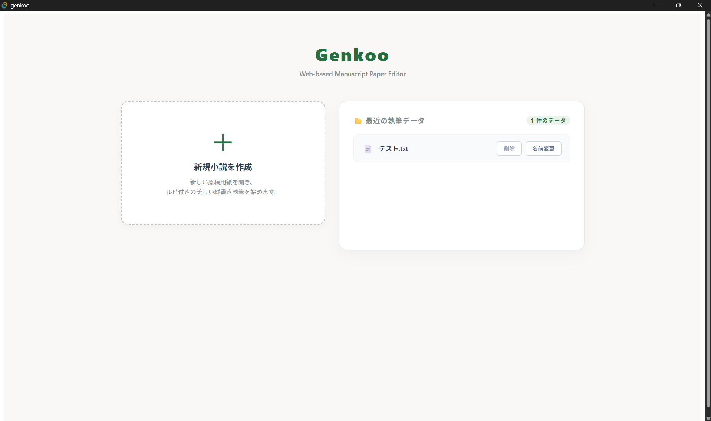
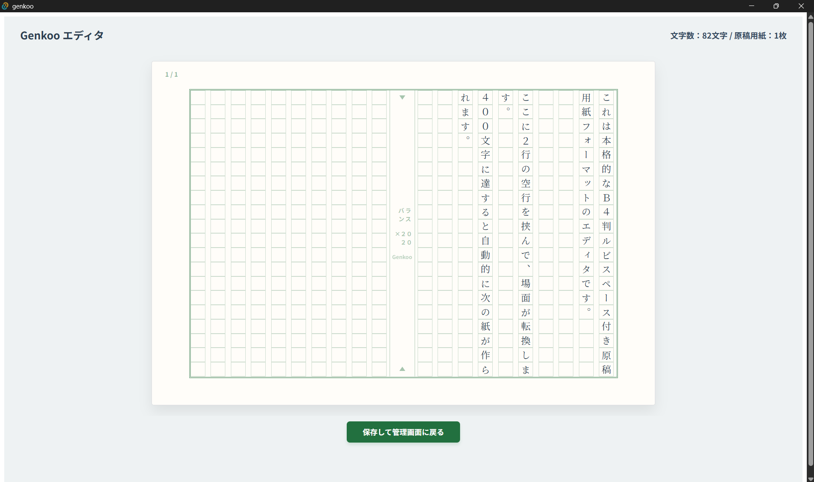

# Project Genkoo -縦書き・原稿用紙型テキストエディタ- v.1.0.0

## 1. 本プロジェクトの目的
### 1-1. 開発背景
- 本プロジェクトは、自身が小説執筆のために扱いやすいテキストエディタを作成する目的で、完全オフラインで動作するデスクトップアプリの開発を行うものです。
- Node.js、Rust、Tauri、TypeScriptといった、現行の開発環境に習熟する目的も兼ねています。
- 基本設計・要件定義などは自身で行い、コーディングには生成AI（主にGemini）を活用しています。

### 1-2. 機能の特徴
- 自身の執筆スタイルに合わせ、「原稿用紙に手書きしたもの」をそのままPC上で再現できることを主眼に置いています。
- 現状、エディタ内での表示は「縦書き・400字詰め原稿用紙」に直接打ち込む形式にのみ対応しています。
- データ保存形式は`.txt`、またはpdf出力に対応する予定です。

### 1-3. ドキュメント類
本プロジェクトでは、開発中に以下のドキュメントで設計と進捗管理を行っています。
- [要件定義書](./docs/requirements.md)
- [画面仕様書](./docs/basic-design/screen-specifications/)
- [進捗管理表](./docs/schedule.md)

## 2. ディレクトリ構成

```tree
.
|-- LICENSE
|-- README.md
|-- docs/
|   |-- basic-design/
|   |-- images/
|   |-- requirements.md
|   `-- schedule.md
`-- genkoo/
    |-- README.md
    |-- index.html
    |-- node_modules/
    |-- package-lock.json
    |-- package.json
    |-- public/
    |-- src/
    |-- src-tauri/
    |-- tsconfig.json
    |-- tsconfig.node.json
    `-- vite.config.ts
```
## 3. インストール手順
本アプリは、windows上でのみ動作確認が完了しています。macOSでの動作確認は未実施です（2026.06.16）。

### 3-1. インストーラーのダウンロード
[Releases ページ](https://github.com/yskamioyc-cmyk/genkoo/releases)にアクセスし、お使いのOSに合わせて最新のファイルをダウンロードしてください。

* **Windows をお使いの方:** `genkoo_1.0.0_x64-setup.msi`（または `.exe`）
* **macOS をお使いの方:** `genkoo_1.0.0_x64.dmg`（または `_aarch64.dmg`）

---

### 3-2. OSごとのインストール手順

Tauriアプリ（個人開発・未署名の場合）を初めてインストールする際、OSのセキュリティ警告が表示されることがあります。その場合は以下の手順で進めてください。

#### 🔷 Windows の場合
1. ダウンロードした `.msi` ファイルをダブルクリックして実行します。
2. 青い画面で **「Windows によって PC が保護されました」** と警告が表示された場合、画面内の **[詳細情報]** というテキストをクリックします。
3. 右下に現れる **[実行]** ボタンをクリックすると、安全にインストールが開始されます。

#### 🔷 macOS の場合
1. ダウンロードした `.dmg` ファイルを開き、現れたアプリのアイコンを `Applications`（アプリケーション）フォルダにドラッグ＆ドロップします。
2. アプリを起動した際に **「開発元を検証できないため開けません」** と警告が出た場合は、一度 [キャンセル] を押します。
3. Macの `システム設定 > プライバシーとセキュリティ` を開き、画面の下方にある **[このまま開く]** ボタンをクリックして、パスワードを入力して実行してください。

## 4. 開発環境のセットアップ手順
- 【動作環境】**Node.js**(v20以上)と、**Rust**(最新版)がインストールされている、windows11（25H2以降）搭載PCを使用してください。

### 4-1. リポジトリのクローン
* 以下のコマンドをターミナルで実行してください。
```bash
git clone https://www.github.com/yskamioyc-cmyk/genkoo.git
```

### 4-2. 依存関係のインストール
* クローン直後はライブラリが不足しているため、以下のコマンドを実行して依存関係をインストールしてください。
```bash
cd genkoo
npm install
```

### 4-3. 開発サーバーの起動（Tauri）
* インストールが完了したら、以下のコマンドでTauriの開発環境を起動します（初回起動時はRustの依存ライブラリのコンパイルが行われるため、少し時間がかかります）。
```bash
npm run tauri dev
```

## 5. 動作画面
* アプリ起動時の管理画面は以下の通りです。
<p align = "center">
  
</p>

* エディタの動作画面例は以下の通りです。
<p align = "center">
    
</p>

## 6. 特徴

* **Tauriの採用**: Electron製アプリと比較して、アプリのファイルサイズが劇的に小さく（数MB程度）、起動が高速でメモリ消費量が極めて少ない執筆環境を実現するため。
* **React + グリッドデザイン**: 原稿用紙の「20文字×20行（400字）」という厳密なマス目を、CSS Gridを用いて1マス単位でWeb標準かつレスポンシブに制御・レンダリングするため。

## 7. 技術スタック

本アプリケーションは、軽量・高速なデスクトップアプリを構築するために **Tauri** を採用し、フロントエンドに **React** と **TypeScript** を組み合わせた高パフォーマンスなアーキテクチャで開発されています。

### 🌐 フロントエンド (Frontend)
* **ライブラリ:** React 18+ (Hooks / Functional Components)
* **言語:** TypeScript (静的型付けによる安全な開発)
* **ビルドツール:** Vite (高速なホットリロードとバンドル)
* **スタイリング:** Inline Styles (CSS-in-JSアプローチによるコンポーネント完結型スタイル)

### 🦀 バックエンド / デスクトップ層 (Backend / Desktop Layer)
* **フレームワーク:** Tauri v2 (Rustベースの次世代デスクトップアプリ枠組み)
* **言語:** Rust (メモリ安全かつ超軽量なネイティブバイナリの生成)
* **機能連携:** * `tauri::command` (Frontend ⇄ Backend 間の非同期IPC通信)
  * Rust `std::fs` モジュールによるローカルファイル（.txt）のセキュアな入出力管理

### 🛠️ 開発・環境管理 (Tools)
* **パッケージマネージャー:** npm
* **バージョン管理:** Git / GitHub

## 8. 今後の課題

- [ ] **クロスプラットフォーム（マルチOS）におけるIME入力の最適化**
  - 現在、Windows/macOS環境を中心に最適化されています。Linux環境（Ubuntu + Fcitx5等）において、縦書き入力時に一部の記号（長音「ー」など）が正しく回転しない挙動が確認されているため、フロントエンドでの文字置換ロジックの導入、およびOS依存のフォントレンダリングのフォールバックを計画しています。
- [x] **作品のファイル管理機能（リネーム・削除・新規ファイル作成のDashboard完結）**
- [x] **禁則処理の最適化**
  - 現段階では禁則処理非対応のため、基本的な禁則処理機能を実装し、設定項目で禁則処理ルールを変更可能なように機能を実装予定。
  
## 9. 更新履歴
* **2026-06-18**: RC第4版作成
* **2026-06-16**: RC版作成・プレリリース
* **2026-06-15**: PDF出力時の外見をブラッシュアップ
* **2026-06-05**: PDF出力機能をアップデート
* **2026-06-02**: 禁則処理・PDF出力機能を実装
* **2026-05-29**: 初版作成