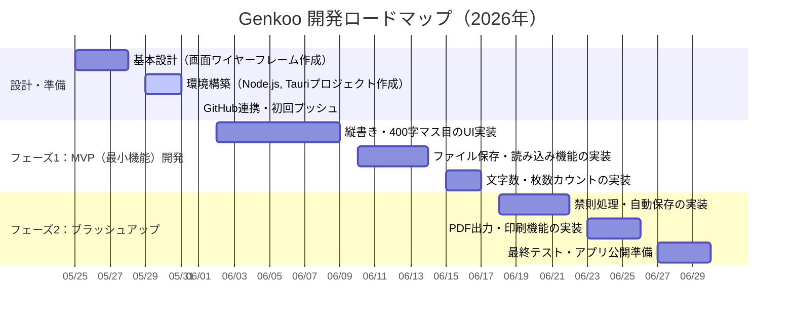

# 開発スケジュール（Genkoo）v.1.0.0
## 更新履歴
- **2026-05-25**: 初版作成
## ガントチャート

## マイルストーン

### 🏁 マイルストーン1：設計と環境構築（目標：5月末まで）
- [x] draw.ioでの画面設計図の完成
- [ ] Node.js, Tauri環境のセットアップ完了
- [ ] GitHubへのリポジトリ作成とファーストコミット

### 🏁 マイルストーン2：文字が書けて保存できる（目標：6月15日まで） 【MVP】
- [ ] CSS Gridを使った「20×20のマス目」の表示
- [ ] 縦書き（`writing-mode: vertical-rl`）でのテキスト入力対応
- [ ] ローカルへのファイルの新規保存・上書き保存機能

### 🏁 マイルストーン3：執筆サポート機能と公開（目標：6月末まで）
- [ ] リアルタイム文字数・原稿用紙枚数カウント
- [ ] オートセーブ（自動保存）機能
- [ ] アプリのビルド（.exe / .dmg の書き出し確認）